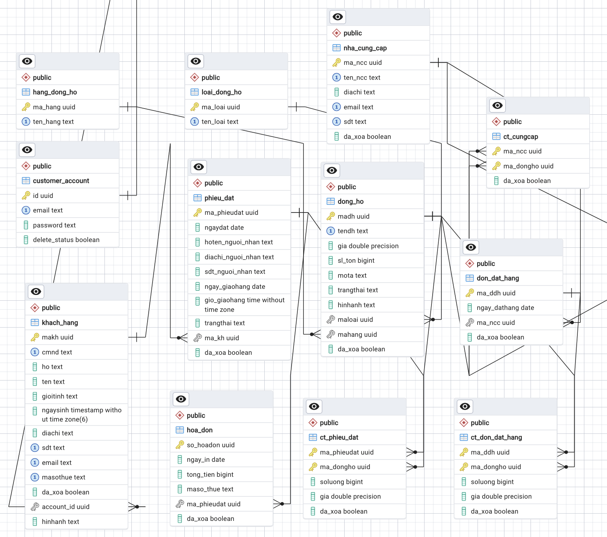

# The Watchers

*A simple watch selling website*

---

## Mô tả website

Website bán đồng hồ online sẽ lưu giữ các thông tin sau:

- Website bán nhiều đồng hồ, thông tin đồng hồ bao gồm mã đồng hồ để phân biệt các đồng hồ với nhau, tên đồng hồ, giá, số lượng tồn, mô tả, trạng thái, hình ảnh. Một loại đồng hồ có nhiều đồng hồ và một đồng hồ chỉ thuộc một loại đồng hồ.
- Một đồng hồ thuộc một hãng đồng hồ, một hãng có nhiều đồng hồ.
- Nhà cung cấp sẽ cung cấp nhiều đồng hồ thuộc các hãng khác nhau. Nhà cung cấp sẽ có thông tin: mã nhà cung cấp để phân biệt với nhà cung cấp khác, tên nhà cung cấp, địa chỉ, email, số điện thoại.
- Khi nhập hàng thì sẽ đặt hàng cho nhà cung cấp. Một đơn đặt hàng chỉ gởi cho một nhà cung cấp, trong đơn đặt hàng có thông tin mã đơn đặt hàng để phân biệt các đơn đặt hàng, ngày đặt hang. Một nhà cung cấp có thể được đặt hàng nhiều lần.
- Một đơn hàng có thể đặt nhiều đồng hồ khác nhau, một đồng hồ có thể được đặt hàng nhiều lần. Một đồng hồ trong đơn đặt hàng phải chỉ rõ số lượng đặt, và đơn giá.
- Khách hàng có thể đặt hàng online nhiều lần với nhiều phiếu đặt khác nhau. Phiếu đặt có thông tin: ngày đặt, họ tên người nhận, địa chỉ người nhận, số điện thoại người nhận, ngày giờ giao hàng. Một phiếu đặt của khách hàng tại một thời điểm chỉ thuộc một trong các trạng thái sau: chờ duyệt, chuẩn bị đơn hàng, đã chuyển hàng cho shiper, đang giao hàng, hoàn tất, đã hủy. Một phiếu đặt chỉ thuộc một khách hàng.
- Một phiếu đặt của khách hàng có thể có nhiều đồng hồ khác nhau và một đồng hồ có thể được đặt nhiều lần trên nhiều phiếu đặt.
- Khách hàng có thông tin: id, số CMND, họ, tên, giới tính, ngày sinh, địa chỉ, số điện thoại, email, mã số thuế.
- Đồng hồ có thể thay đổi giá theo thời gian.
- Sau khi khách hàng đặt hàng, hóa đơn sẽ được tính toán và gửi cho khách hàng. Một phiếu đặt sẽ có một hóa đơn duy nhất tương ứng, thông tin hóa đơn gồm: số hóa đơn, ngày in hóa đơn, tổng tiền và mã số thuế.
- Trong năm, sẽ có các đợt khuyến mãi (KM) giảm giá đồng hồ. Mỗi đợt khuyến mãi có thông tin: mã đợt KM để phân biệt các đợt KM, lý do KM, ngày bắt đầu, ngày kết thúc. Trong 1 đợt KM, mỗi đồng hồ có phần trăm giảm giá riêng.

## Xác định thực thể

1. LOAIDONGHO (<u>**MALOAIDH**</u>, TENLOAI)
2. HANGDONGHO (<u>**MAHANGDH**</u>, TENHANG)
3. DONGHO (<u>**MADH**</u>, TENDH, GIA, SLTON, MOTA, TRANGTHAI, HINHANH)
4. NHACUNGCAP (<u>**MANCC**</u>, TENNCC, DIACHI, EMAIL, SDT)
5. DONDATHANG (<u>**MADDH**</u>, NGAYDH)
6. PHIEUDAT (<u>**MAPD**</u>, NGAY_DAT, HOTEN_NGUOI_NHAN, DIACHI_NGUOI_NHAN, SDT_NGUOI_NHAN, NGAYGIO_GIAOHANG, TRANGTHAI)
7. KHACHHANG (<u>**MAKH**</u>, EMAIL, PASSWORD, SALT, CMND, HO, TEN, GIOITINH, NGAYSINH, DIACHI, SDT, MA_SOTHUE)
8. HOADON (<u>**SOHD**</u>, NGAY_IN_HD, TONG_TIEN, MA_SOTHUE)

## Mô hình thực thể quan hệ - ERD

## Dạng chuẩn 3

### Quy ước

- <u>**Khóa chính**</u>: In đậm và gạch chân.
- *Khóa tương đương*: in nghiêng.
- **Khóa ngoại**: in đậm.

### Mô hình dữ liệu

1. LOAIDONGHO (<u>**MALOAIDH**</u>, TENLOAI)
2. HANGDONGHO (<u>**MAHANGDH**</u>, TENHANG)
3. DONGHO (<u>**MADH**</u>, TENDH, GIA, SLTON, MOTA, TRANGTHAI, HINHANH, **LOAIDH**, **HANGDH**)
4. NHACUNGCAP (<u>**MANCC**</u>, *TENNCC*, DIACHI, *EMAIL*, *SDT*)
5. CT_CUNGCAP (<u>**MANCC, MADH**</u>)
6. DONDATHANG (<u>**MADDH**</u>, NGAYDH, **MANCC**)
7. CT_DONDATHANG (<u>**MADDH, MADH**</u>, SL, GIA)
8. PHIEUDAT (<u>**MAPD**</u>, NGAY_DAT, HOTEN_NGUOI_NHAN, DIACHI_NGUOI_NHAN, SDT_NGUOI_NHAN, NGAYGIO_GIAOHANG, TRANGTHAI, **MAKH**)
9. CT_PHIEUDAT (<u>**MAPD, MADH**</u>, SOLUONG, GIA)
10. KHACHHANG (<u>**MAKH**</u>, *EMAIL*, *PASSWORD*, *SALT*, *CMND*, HO, TEN, GIOITINH, NGAYSINH, DIACHI, *SDT*, *MASO_THUE*)
11. HOADON (<u>**SOHD**</u>, NGAY_IN_HD, TONG_TIEN, MA_SOTHUE, **MAPD**)

## Mô hình - Diagram

